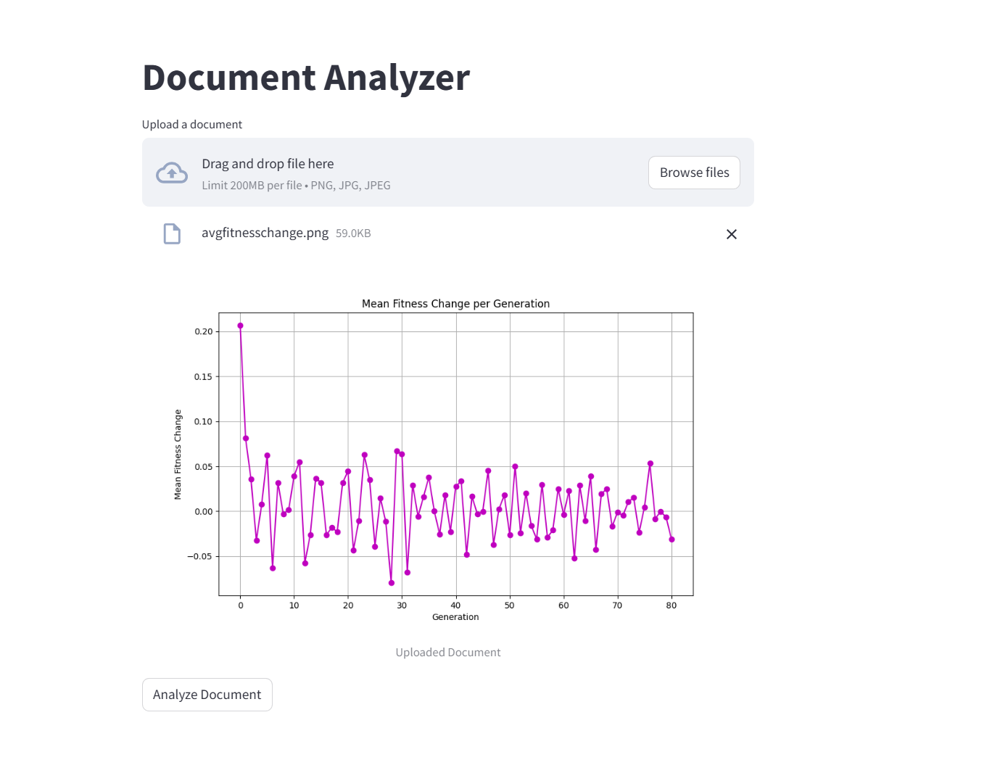
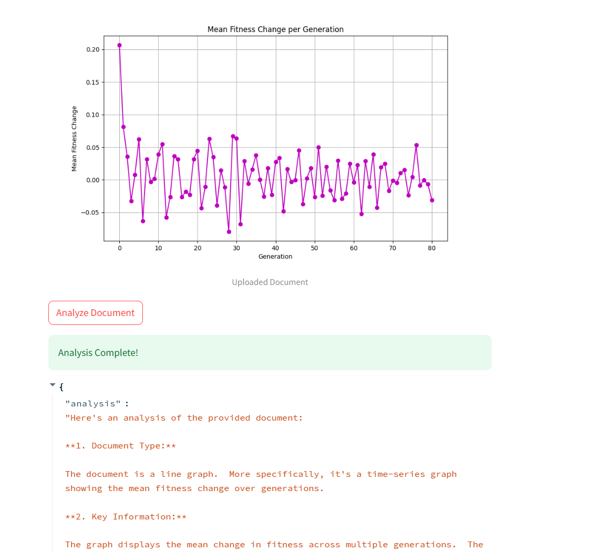
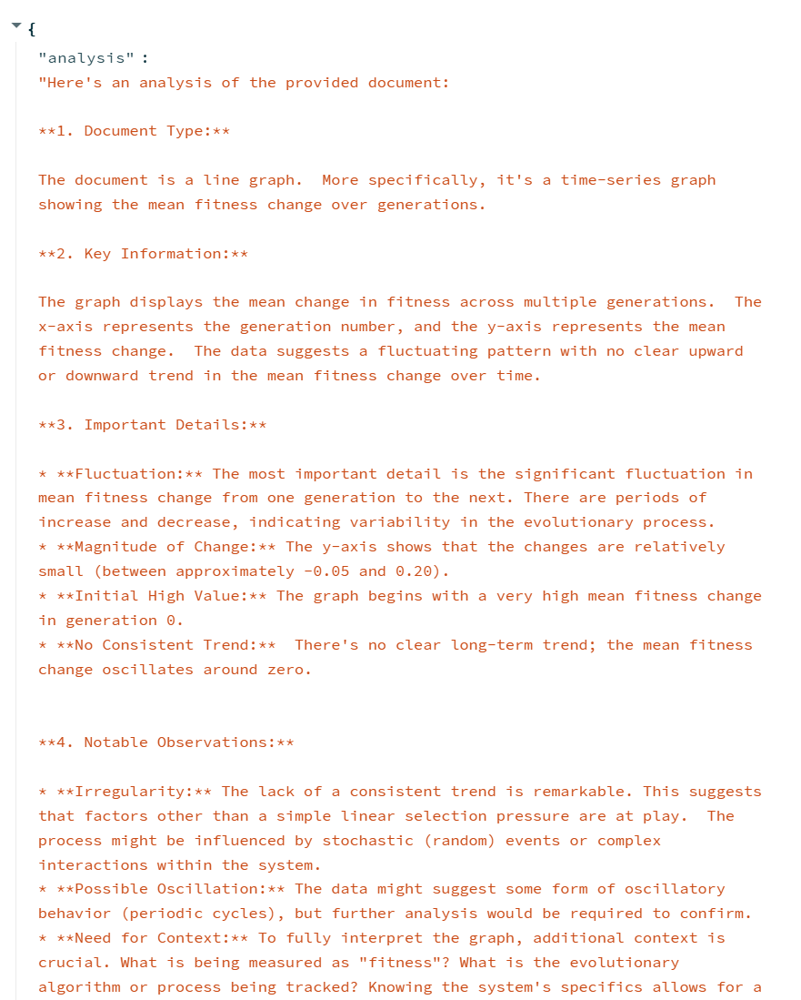
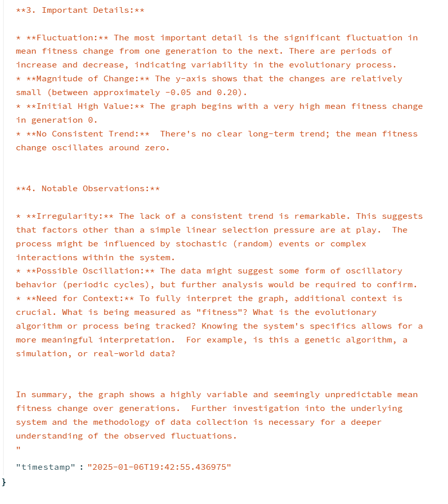
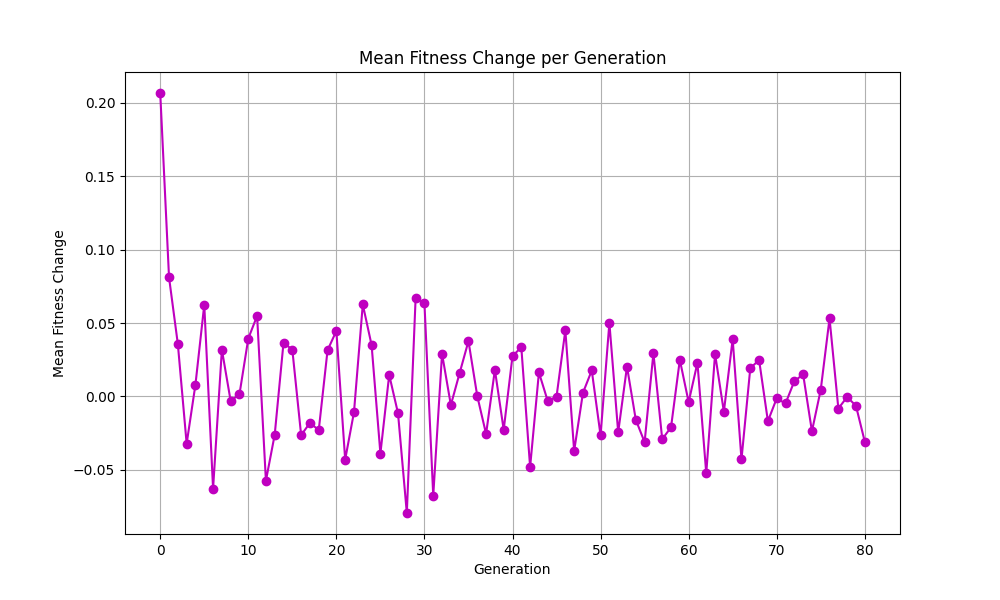
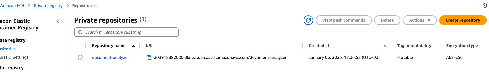
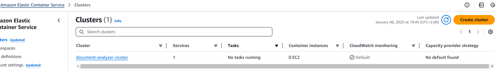
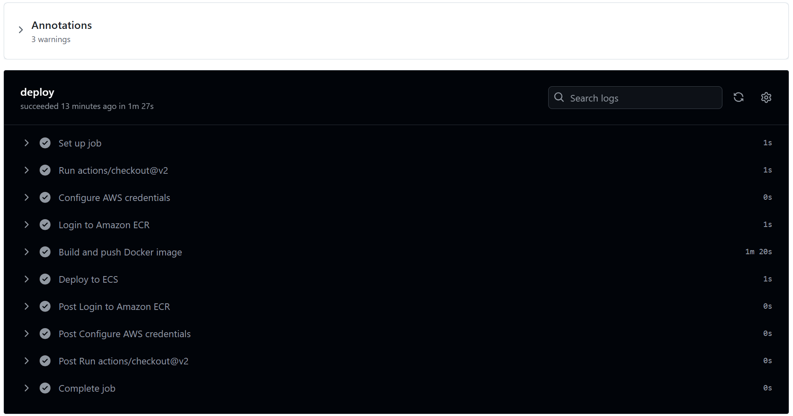
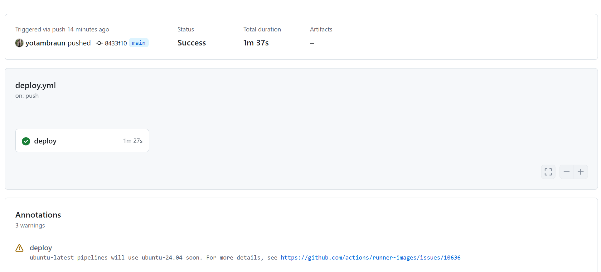
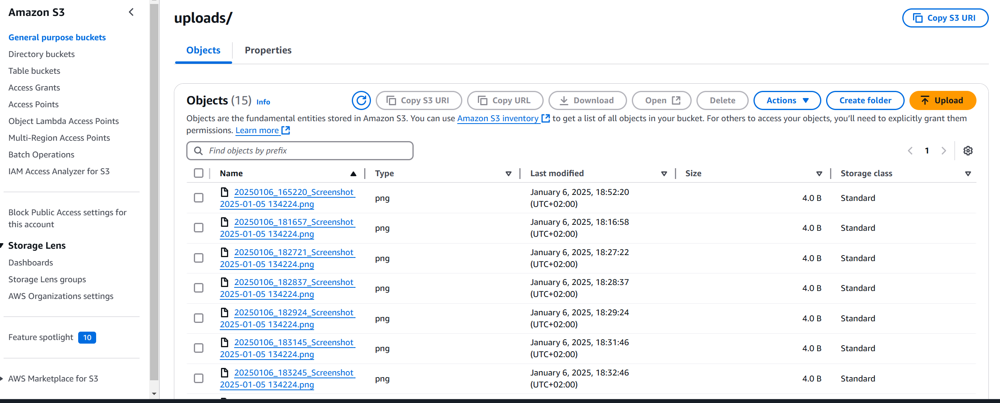

# VisualInsight - App using Google Generative AI (Gemini)
<p align="center">
  <!-- Python -->
  
  <!-- Streamlit -->
  
  <!-- Google Generative AI (Gemini) -->
  
  <!-- AWS -->
  
  <!-- Docker -->
  
  <!-- Terraform -->
  
  <!-- GitHub Actions -->
  
</p>

A Streamlit-based web application that analyzes images using Google Generative AI (Gemini) and stores both the original images and analysis in Amazon S3.
I have also written a [Medium article](https://medium.com/@yotambraun/visualinsight-an-end-to-end-image-analysis-application-using-google-generative-ai-gemini-7847f6f0a1b9) about this project, detailing its features and implementation.
## Table of Contents

- [Overview](#overview)
- [Architecture](#architecture)
- [Features](#features)
- [Prerequisites](#prerequisites)
- [Local Development](#local-development)
  - [Environment Variables](#environment-variables)
  - [Running Locally](#running-locally)
- [Docker](#docker)
  - [Building the Image](#building-the-image)
  - [Running the Container](#running-the-container)
- [Terraform Deployment](#terraform-deployment)
- [CI/CD with GitHub Actions](#cicd-with-github-actions)
- [Screenshots](#screenshots)
- [License](#license)

---

## Overview

VisualInsight is a simple image-analysis solution that:

1. Lets you upload an image (JPG/PNG) via the Streamlit interface.
2. Sends the image to Google Generative AI (Gemini) for an analysis prompt.
3. Stores the image in an AWS S3 bucket.
4. Displays the AI-generated analysis to the user.

---

## Architecture

1. **Frontend**: Streamlit application (Python).
2. **Backend**: 
   - AWS S3 for file storage.
   - Google Generative AI for text analysis.
3. **Infrastructure**:
   - Terraform for provisioning AWS resources (S3, ECR, ECS, IAM roles/policies, etc.).
4. **Docker**: Container image for the Streamlit app.
5. **CI/CD**:
   - GitHub Actions workflow to build and push Docker images to ECR, and update the ECS service.

---

## Features

- **Image Upload**: Users can upload images (JPEG, PNG, etc.).
- **AI Image Analysis**: Using Google Generative AI API (Gemini).
- **S3 Storage**: Uploaded images are stored in an S3 bucket.
- **Dockerized**: Streamlit application wrapped in a Docker container.
- **Scalable Infrastructure**: Terraform-managed infrastructure on AWS.
- **Continuous Deployment**: GitHub Actions pipeline automates Docker builds and ECS deployments.

---

## Prerequisites

1. **Python 3.9+** (for local testing).
2. **Docker** installed (for containerization).
3. **Terraform** installed (if you plan to deploy via Terraform).
4. **AWS Account** and credentials with appropriate permissions.
5. **Google Cloud** API key for Generative AI (Gemini).
6. **GitHub Actions** set up with secrets:
   - `AWS_ACCESS_KEY_ID`
   - `AWS_SECRET_ACCESS_KEY`
   - `AWS_REGION` (e.g., `us-east-1`)

---

## Local Development

### Environment Variables

Create a `.env` file in the project root (or set these in your environment) with the following values:

```bash
AWS_ACCESS_KEY_ID="YOUR_AWS_ACCESS_KEY_ID"
AWS_SECRET_ACCESS_KEY="YOUR_AWS_SECRET_ACCESS_KEY"
AWS_REGION="us-east-1"
S3_BUCKET_NAME="YOUR_S3_BUCKET_NAME"
GOOGLE_API_KEY="YOUR_GOOGLE_API_KEY"
```

### Running Locally

1. Install dependencies:

```bash
pip install -r requirements.txt
```

2. Run the Streamlit app:

```bash
streamlit run app/main.py
```

3. Access the app by opening your browser to:
http://localhost:8501

---
## Docker

### Building the Image

1. Build the Docker image:

```bash
docker build -t visualinsight:latest .
```

2. Check that the image was built:

```bash
docker images
```

### Running the Container

1. Run the Docker container:

```bash
docker run -p 8501:8501 \
    -e AWS_ACCESS_KEY_ID="YOUR_AWS_ACCESS_KEY_ID" \
    -e AWS_SECRET_ACCESS_KEY="YOUR_AWS_SECRET_ACCESS_KEY" \
    -e AWS_REGION="us-east-1" \
    -e S3_BUCKET_NAME="YOUR_S3_BUCKET_NAME" \
    -e GOOGLE_API_KEY="YOUR_GOOGLE_API_KEY" \
    visualinsight:latest
```

2. Open the browser at http://localhost:8501.


## Terraform Deployment
This project includes Terraform configurations to create and manage AWS resources (S3 bucket, ECR repository, ECS cluster, etc.).

1. Initialize Terraform:

```bash
cd infrastructure/terraform
terraform init
```

2. Validate the configuration:

```bash
terraform validate
```

3. Preview changes:

```bash
terraform plan -var="bucket_name=bucket_name"
```

4. Apply the changes:

```bash
terraform apply -var="bucket_name=bucket_name"
```

Once complete, Terraform will:
* reate an S3 bucket (with the specified name).
* Create an ECR repository (for the Docker image).
* Create an ECS cluster, IAM roles, policies, etc.

---

## CI/CD with GitHub Actions
The **.github/workflows/deploy.yml** file automates:

1. **Checkout** of your code.
2. **AWS credentials configuration**.
3. **Docker build and push** to AWS ECR.
4. **Forcing a new ECS deployment** to pull the latest image.

To use this workflow, you need to set the following **GitHub Secrets**:
Go to **Settings > Secrets and variables > Actions** in your GitHub repository and add:

* `AWS_ACCESS_KEY_ID`
* `AWS_SECRET_ACCESS_KEY`
* `AWS_REGION`
* `S3_BUCKET_NAME`
* `GOOGLE_API_KEY`

With these secrets configured, any push to the main branch triggers the build-and-deploy workflow.


## Screenshots

### 1. Uploading an Image



### 2. Analysis Results

| Screenshot                      | Description                     |
|--------------------------------|---------------------------------|
|  | First analysis page demo        |
|  | Second analysis page demo       |
|  | Third analysis page demo        |

### 3. Example Original Image



### 4. AWS ECR



### 5. AWS ECS



### 6. GitHub Actions

| Screenshot                                                 | Description                     |
|------------------------------------------------------------|---------------------------------|
|             | Full GitHub Actions workflow    |
|               | Partial view of the CI/CD steps |

### 7. S3 Bucket




## License

This project is licensed under the [MIT License](LICENSE).